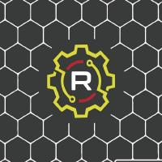

# Ryper3D Design

Aficionados por la tecnología 3D y obsesionados por mejorar impresoras/componentes decidimos unirnos formando Ryper3D.

Nos encanta rediseñar, optimizar y mejorar cualquier componente que usemos en nuestro día a día relacionado con la impresión 3D en especial MMU2S del cual hemos rediseñado para eliminar el selector y tener disponibles más número de materiales (hasta 10).

Espero que, como nosotros, disfrutéis de todo lo que hacemos!!!

