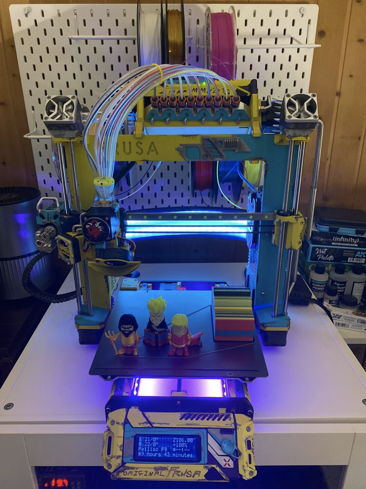

# Que es MMU2+1S?

Es un sistema multimaterial basado en el MMU2 Prusa mejorando/simplificando el selector de filamento con lo que ahorramos componentes como un motor y sensor además de que al simplificar el diseño obtendremos menos fallos.

Para sustituir el selector de filamentos se utiliza un "splitter" para el . En la siguiente imagen de uno de los componentes de la [**comunidad Ryper 3D**](https://t.me/RYPER3D) podréis ver el resultado final.

